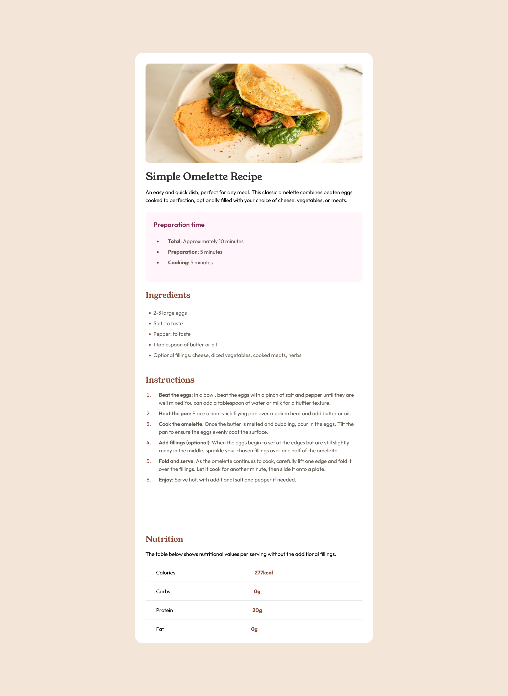

# Frontend Mentor - Recipe page solution

This is a solution to the [Recipe page challenge on Frontend Mentor](https://www.frontendmentor.io/challenges/recipe-page-KiTsR8QQKm). Frontend Mentor challenges help you improve your coding skills by building realistic projects.

## Table of contents

- [Overview](#overview)
  - [The challenge](#the-challenge)
  - [Screenshot](#screenshot)
  - [Links](#links)
- [My process](#my-process)
  - [Built with](#built-with)
  - [What I learned](#what-i-learned)
  - [Continued development](#continued-development)
  - [Useful resources](#useful-resources)
- [Author](#author)

## Overview

### The challenge

#### Challenge with HSL Color in Tailwind CSS Configuration

The color provided is in HSL (Hue, Saturation, Lightness) format, which is not directly compatible with Tailwind CSS configuration using HEX or RGB.

#### Solution

To address this challenge, convert the HSL color to HEX format using Google's default color picker.

##### Example:

1. Use Google's default color picker or another tool to obtain the HEX equivalent of the HSL color.  
2. Update the Tailwind CSS configuration with the HEX color.

```javascript
// tailwind.config.js

module.exports = {
  theme: {
    extend: {
      colors: {
        customColor: '#XXXXXX', // Replace with your HEX color
      },
    },
  },
};
```

#### Challenge with Integrating TTF Files for Fonts

I encountered a challenge while working on the project regarding font integration. Instead of using the Google Fonts API, I opted to include TTF files directly.

#### Solution
Successfully addressed the font integration challenge by utilizing the `@font-face` CSS rule. This solution allows for custom font definition directly in the project, providing greater control over the font rendering.

```css
/* fonts.css */
@font-face {
  font-family:'YoungSerif' ;
  src: url('../assets/fonts/young-serif/YoungSerif-Regular.ttf') format('truetype');
}

.title { 
  font-family: 'YoungSerif';
  font-weight: 400;
  font-style: normal;
}
```

### Screenshot



### Links

- Solution URL: [Add solution URL here](https://www.frontendmentor.io/solutions/responsive-landing-page-for-recipe-webpage-MXndJvs_tW)
- Live Site URL: [Add live site URL here](https://recipe-page-tan.vercel.app/)

## My process

### Built with

- Semantic HTML5 markup
- CSS custom properties
- Flexbox
- [Tailwinscss](https://www.tailwindcss.com)

### What I learned

 some of major learnings while working through this project. Writing is a great way to reinforce our own knowledge.

 code snippets, see below:

```css
/* fonts.css */
@font-face {
  font-family:'YoungSerif' ;
  src: url('../assets/fonts/young-serif/YoungSerif-Regular.ttf') format('truetype');
}

.title { 
  font-family: 'YoungSerif';
  font-weight: 400;
  font-style: normal;
}
```

### Continued Development

During this HTML and Tailwind CSS project, I've identified key areas to enhance my skills:

1. **HTML Mastery:**
   - Deepening understanding for creating structured and meaningful content.

2. **Tailwind CSS Proficiency:**
   - Strengthening skills in efficient styling and responsive design.

3. **Responsive Design:**
   - Enhancing expertise in creating responsive layouts for diverse devices.

4. **Git for Version Control:**
   - Integrating version control using Git for effective project management and collaboration.

5. **Documentation Practices:**
   - Improving documentation to enhance code readability and collaboration.

These targeted areas reflect my commitment to continuous improvement within the realm of HTML and Tailwind CSS. I look forward to applying these refined skills in upcoming projects.


### Useful resources

- [Html and css resouce:1](https://htmlandcssguidebook.com/) - This helped me for refering and rework. I really liked this pattern and will use it going forward.
- [Css Flexbox resource:2](https://htmlandcssguidebook.com/) - This helped me for responsive design specific to flexbox.
- [Tailwind resource:3](https://tailwindcss.com) - This is an tailwind documentation and this is enough to get better at this skill. I'd recommend it to anyone still learning this concept.

## Author

- Website - [Yogesh](https://yogesh-portfolio.dev)
- Frontend Mentor - [@yogesh-stack-dev](https://www.frontendmentor.io/profile/yogesh-stack-dev)
- Twitter - [@YOGESHISACTIVE](https://www.twitter.com/YOGESHISACTIVE)
